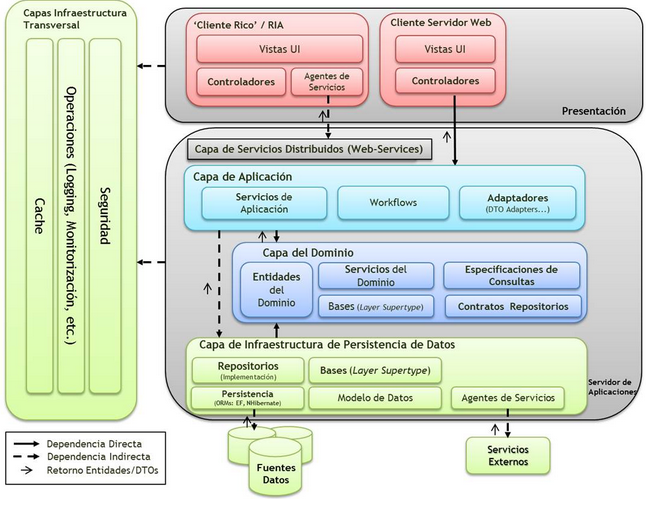
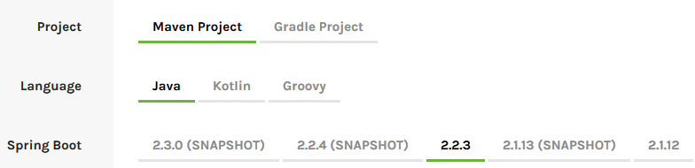
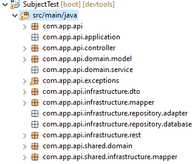
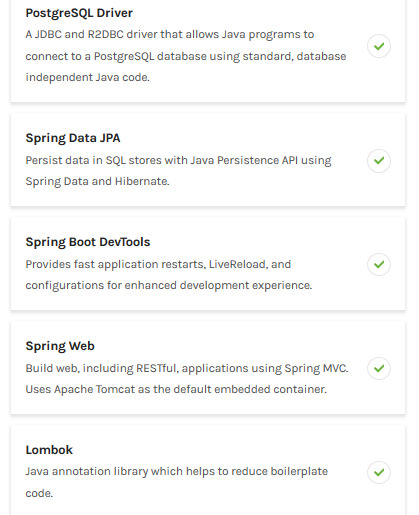
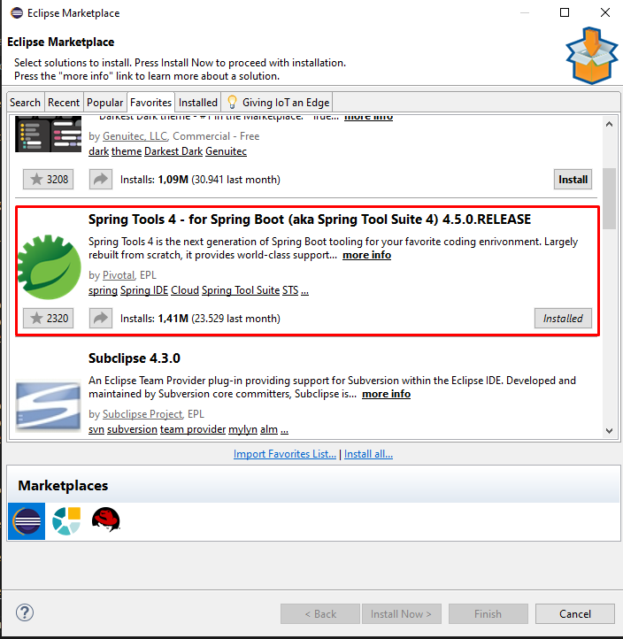
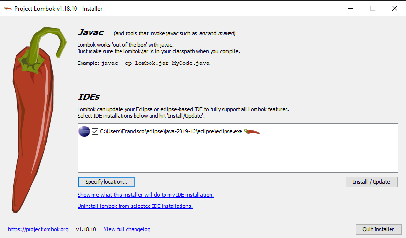
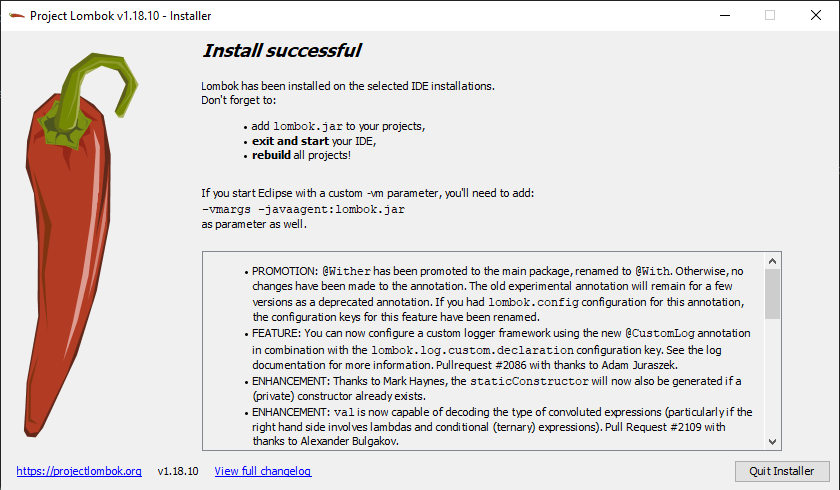

# Arquitectura DDD

La arquitectura Diseño guiado por el dominio **(Domain Driven Design)** es un conjunto de patrones principos y práticas que nos ayudan a resolver y entender los problemas del negocio **(Dominio)** en el diseño de sistemas orientados a objetos.  



# Spring Framework

Spring, ofrece como elemento clave el soporte de infraestructura a nivel de aplicación, brindando un completo modelo tanto para la configuración como para la programación de aplicaciones empresariales desarrolladas bajo Java, sin discriminación en cuanto al despliegue de la plataforma.

Todo esto trae consigo una gran ventaja, ya que permite que los equipos de desarrollo puedan enfocarse directamente en la lógica empresarial que requiere la aplicación, haciendo el proceso más corto, rápido y eficaz, ahorrando líneas de código evitando tareas repetitivas. 

# Contenido

1. [Documentaciones Y Lecturas Sugeridas](#documentaciones-y-lecturas-sugeridas)
2. [Glosario de terminos](#glosario-de-terminos)
3. [Crear un proyecto](#crear-un-proyecto)
4. [Estructura de los proyectos](#estructura-de-los-proyectos)
5. [Esquema de construccion](#esquema-de-construccion)

## [Documentaciones Y Lecturas Sugeridas](#contenido)

1. https://www.baeldung.com/spring-rest-openapi-documentation
2. https://www.baeldung.com/swagger-2-documentation-for-spring-rest-api
3. https://www.baeldung.com/spring-boot-testing
4. https://spring.io/tools

## [Glosario de terminos](#contenido)

- 

## [Crear un proyecto](#contenido)

### Primeros pasos

Con Spring Initializr se pueden generar y configurar proyectos de forma segura y rapida aprovechando las distintas configuraciones y opciones que nos ofrece la plataforma.

Para Crear un proyecto basta con ingresar al siguiente enlace https://start.spring.io/ para asi seleccionar los campos deseados tal y como se explicara a continuacion:

**Paso 1:** Opciones para la creacion del proyecto

Dependiendo de las necesidades de nuestro proyecto podemos seleccionar entre **Maven** o **Gradel** que son herramientas de software libre para gestionar proyectos Java.

Del mismo modo se nos brindan 3 opciones para el lenguaje de programacion que estara presente en todo nuestro los cuales son: Java, Kotlin y Groovy.

Finalmente, se debe seleccionar la version de Spring Boot a utilizar, para est se recomienda utilizar la version estable, la cual se ve seleccionada por defecto. 



**Paso 2:** Metadatos del proyecto

En este paso se debe escribir el grupo donde iran los archivos, el artifact que corresponde al nombre del proyecto.

A continuacion, dentro de opciones escribir la informacion referente al nombre y descripcion del proyecto, junto con el nombre del paquete que sera generado. Para finalmente seleccionar el tipo de empaquetado donde se comprimira el proyecto y version del lenguaje seleccionado previamente. 



**Paso 3:** Dependencias

Las dependencias hacen parte esencial sde cada proyecto y pueden variar dependiendo de las necesidades de cada uno, pero las dependencias estandar que no pueden faltar son las que se muestran en la siguiente imagen.



- **SQL Driver o NoSQL Driver:** Puede seleccionarse entre los 2 motores de bases de datos relacionales MySQL y PosgresSQL o en su lugar MongoDB que permiten que los programas se conecten a una base de datos.  
- **Spring Data JPA:** Persista los datos en los almacenes de SQL con Java Persistence API usando Spring Data e Hibernate.
- **Spring Boot DevTools:** Proporciona reinicios rápidos de aplicaciones, LiveReload y configuraciones para una experiencia de desarrollo mejorada.
- **Spring Web:** Cree aplicaciones web, incluidas RESTful, con Spring MVC. Utiliza Apache Tomcat como el contenedor integrado predeterminado.
- **Lombok:** Biblioteca de anotaciones Java que ayuda a reducir el código repetitivo.

**Paso 4:** Generar proyecto

A continuacion, se debe hacer click en el boton **Generate** para obtener el archivo comprimido con nuestro proyecto ya preparado para ser montado en el IDE de nuestra preferencia, aunque se recomienda usar eclipse para estos casos.

**(Opcional) Paso 5:** Adicionar Estructura trabajada en ZABUD

Para mayor comodidad al momento de trabajar nuevos proyectos pude descargar el siguiente archivo: [Estructura](./Estructure.zip).

Al finalizar la descarga, extraiga el archivo y copie el contenido dentro de la carpeta que coniene el archivo principal de su proyecto.

**Paso 6:** Importar proyecto al IDE

Si se usa eclipse basta con importar el proyecto si es maven o importar archivo de forma general.

Para activar Spring Boot en eclipse IDE se necesita descargar la extension Spring Boot Tools 4 del market place el cual se puede acceder desde el menu help.



**Paso 7:** Activar Swagger 2

Se deben agregar las siguientes lineas de codigo dentro de nuestro archivo `pom.xml` que se encuentra en la raiz del proyecto dentro de las etiquetas `<dependencies></dependencies>`.

```
<dependency>
    <groupId>io.springfox</groupId>
    <artifactId>springfox-swagger2</artifactId>
    <version>2.9.2</version>
</dependency>

<dependency>
    <groupId>io.springfox</groupId>
    <artifactId>springfox-swagger-ui</artifactId>
    <version>2.9.2</version>
</dependency>
```

**Paso 8:** Lombok

Descargar el paquete Lombok en el siguiente enlace https://projectlombok.org/download.

Abrir el archivo ejecutable y seleccionar el IDE utilizado, finalmente hacer clic en el boton **Install / Update**.



Para finalizar simplemente hacer clic en cerrar o salir de la aplicacion.



**Paso 9:** Conectarse a una base de datos en Postgres

1. Inicializar Pg Admin 4 de nuestra computadora.
2. Tener una base de datos creada.
3. Agregar la siguiente instruccion al archivo `application.properties`.

```
spring.datasource.url=jdbc:postgresql://localhost:5432/Nombre_DB
spring.datasource.password=root
spring.datasource.username=postgres
spring.jpa.properties.hibernate.dialect = org.hibernate.dialect.PostgreSQLDialect
spring.jpa.hibernate.ddl-auto=update
```

**Paso 10:** Ingresar a Swagger

1. Clic derecho sobre el proyecto > run as > clic en spring boot app.
2. Dirigirse a la ruta http://localhost:8080/swagger-ui.html.

## [Estructura de los proyectos](#contenido)

Se proponen seis capas conceptuales las cuales son:

1. Application
2. Controller
3. Domain
4. Exceptions
5. Infraestructure
6. Shared

### Application

Responsable de coordinar todos los elementos de la aplicación. No contiene lógica de negocio ni mantiene el estado de los objetos de negocio. Es responsable de mantener el estado de la aplicación y del flujo de esta.

### Controller

Tiene clases con el objetivo principal de conectar el backend con las solicitudes que se hagan desde afuera de la aplicación(sistemas web, unirest, entre otros).

### Domain

Contiene la información sobre el Dominio. Es el núcleo de la parte de la aplicación que contiene las reglas de negocio. Es responsable de mantener el estado de los objetos de negocio. (La persistencia de estos objetos se delega en la capa de infraestructura.

### Exceptions

En esta capa se detallan los mensajes de errores personalizados para evitar multiples lineas de advertencias para cada uno de los errores que puedan presentarse al momento de realizar una peticion o consulta a nuestra aplicacion.

### Infraestructure

Esta capa es la capa de soporte para el resto de capas. Provee la comunicación entre las otras capas, implementa la persistencia de los objetos de negocio y las librerías de soporte para las otras capas (Interface, Comunicación, Almacenamiento, etc..)

Dado que son capas conceptuales, su implementación puede ser muy variada y en una misma aplicación, tendremos partes o componentes que formen parte de cada una de estas capas. Por ejemplo, en una aplicación web desarrollada con Laravel, Las vistas formarían parte de la capa de Interface, pero Sass o Less, por ejemplo, serían parte de la infraestructura. Algunos componentes del Framework formarían parte de la infraestructura (Eloquent, Caches, etc...) y otros componentes formarían parte de la aplicación (Controladores, Comandos, Eventos, etc..). Los modelos, por ejemplo, formarían parte de la capa de Dominio.

### Shared

En esta capa se brinda el soporte y control de las excepciones generadas durante la ejecucion de un evento, permitendo la captura de errores y lanzamiento de los mensajes personalizados dentro de la capa de Exceptions.

Tambien se encarga de realizar el proceso de transformacion de la infraestructura, donde las entidades del dominio se convierten de REST, DTO o viceversa.

## [Esquema de construccion](#contenido)

Las capas anteriormente descritas son representadas de la siguiente forma, dentro de los proyectos con sus respectivas subcarpetas.

```
com.app.api
com.app.api.application
com.app.api.controller
com.app.api.domain.model
com.app.api.domain.service
com.app.api.exceptions
com.app.api.infrastructure.dto
com.app.api.infrastructure.mapper
com.app.api.infrastructure.repository.adapter
com.app.api.infrastructure.repository.database
com.app.api.infrastructure.rest
com.app.api.shared.domain
com.app.api.shared.infrastructure.mapper
```

En el siguiente esquema se presenta una sugerencia secuencial al momento de construir y codificar la arquitectura de cada proyecto, con el fin de estandarizar un modelo de trabajo y de este modo, facilitar la importacion de metodos de una dependencia a otra.

```
└── src
    └── main
       └── com
           └── api
               └── Main.java 
               |
               infraestructure
               └── dto
                   └── BaseEntity.java
                       [Name]Dto.java
               └── rest
               |   └── [Name]Rest.java     
               |   
               exceptions
               └── [Name]Exceptionjava
               |   ErrorCode.java
               |   HandlerException.java
               |   
               shared
               └── domain 
                   [Name].java
               └── infraestructure   
               |   └── mapper  
               |       └── MapperDto.java
               |           MapperRest.java  
               |      
               domain
               └── model 
                   [Name].java
               └── service 
                   [Name]Service.java    
               |   
               infraestructure
               └── mapper
                   └── [Name]Mapper.java
               └── repository
               |   └── database
               |       └── [Name]Repository.java 
               |   └── adapter
               |       └── [Name]Adapter.java 
               |
               application
               └── [Name]Application.java  
               |
               controller
               └── [Name]Controller.java                              
```