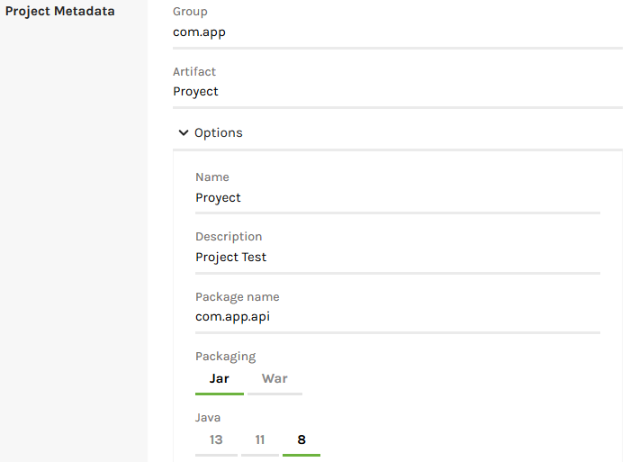

# Arquitectura DDD

La arquitectura Diseño guiado por el dominio **(Domain Driven Design)** es un conjunto de patrones principos y práticas que nos ayudan a resolver y entender los problemas del negocio **(Dominio)** en el diseño de sistemas orientados a objetos.  

# Spring Framework

Spring, ofrece como elemento clave el soporte de infraestructura a nivel de aplicación, brindando un completo modelo tanto para la configuración como para la programación de aplicaciones empresariales desarrolladas bajo Java, sin discriminación en cuanto al despliegue de la plataforma.

Todo esto trae consigo una gran ventaja, ya que permite que los equipos de desarrollo puedan enfocarse directamente en la lógica empresarial que requiere la aplicación, haciendo el proceso más corto, rápido y eficaz, ahorrando líneas de código evitando tareas repetitivas. 

## Documentaciones

1. https://www.baeldung.com/spring-rest-openapi-documentation
2. https://www.baeldung.com/swagger-2-documentation-for-spring-rest-api
3. https://www.baeldung.com/spring-boot-testing
4. https://spring.io/tools

## Glosario de terminos

## Crear un proyecto

Para Crear un proyecto basta con ingresar al siguiente enlace https://start.spring.io/.

Y seleccionar los campos deseados tal y como se muestra en las siguientes imagenes:


## Capas de la arquitectura

## Configuracion del archivo pom.xml

Se deben agregar las siguientes lineas de codigo dentro de nuestro archivo pom.xml

```
<dependency>
    <groupId>io.springfox</groupId>
    <artifactId>springfox-swagger2</artifactId>
    <version>2.9.2</version>
</dependency>

<dependency>
    <groupId>io.springfox</groupId>
    <artifactId>springfox-swagger-ui</artifactId>
    <version>2.9.2</version>
</dependency>
```
## Lombok

Descargar el paquete Lombok en el siguiente enlace https://projectlombok.org/download

## Conectarse a una base de datos en Postgres

1. Inicializar Pg Admin 4 de nuestra computadora.
2. Tener una base de datos creada.
3. Agregar la siguiente instruccion al archivo application.properties.

```
spring.datasource.url=jdbc:postgresql://localhost:5432/Nombre_DB
spring.datasource.password=root
spring.datasource.username=postgres
spring.jpa.properties.hibernate.dialect = org.hibernate.dialect.PostgreSQLDialect
spring.jpa.hibernate.ddl-auto=update
```

## Ingresar a swagger

1. Clic derecho sobre el proyecto > run as > clic en spring boot app.
2. Dirigirse a la ruta http://localhost:8080/swagger-ui.html.

## Estructura de los proyectos

Se proponen seis capas conceptuales:

- application
- controller
- domain
- exceptions
- infraestructure
- shared

Representadas de la siguiente forma dentro de los proyectos con sus respectivas subcarpetas.

```
com.app.api
com.app.api.application
com.app.api.controller
com.app.api.domain.model
com.app.api.domain.service
com.app.api.exceptions
com.app.api.infrastructure.dto
com.app.api.infrastructure.mapper
com.app.api.infrastructure.repository.adapter
com.app.api.infrastructure.repository.database
com.app.api.infrastructure.rest
com.app.api.shared.domain
com.app.api.shared.infrastructure.mapper
```



En el siguiente esquema se presenta una sugerencia secuencial al momento de construir y codificar la arquitectura de cada proyecto, con el fin de estandarizar un modelo de trabajo y de este modo, facilitar la importacion de metodos de una dependencia a otra.

```
└── src
    └── main
       └── com
           └── api
               └── Main.java 
               |
               infraestructure
               └── dto
                   └── BaseEntity.java
                       [Name]Dto.java
               └── rest
               |   └── [Name]Rest.java     
               |   
               exceptions
               └── [Name]Exceptionjava
               |   ErrorCode.java
               |   HandlerException.java
               |   
               shared
               └── domain 
                   [Name].java
               └── infraestructure   
               |   └── mapper  
               |       └── MapperDto.java
               |           MapperRest.java  
               |      
               domain
               └── model 
                   [Name].java
               └── service 
                   [Name]Service.java    
               |   
               infraestructure
               └── mapper
                   └── [Name]Mapper.java
               └── repository
               |   └── database
               |       └── [Name]Repository.java 
               |   └── adapter
               |       └── [Name]Adapter.java 
               |
               application
               └── [Name]Application.java  
               |
               controller
               └── [Name]Controller.java                              
```

## Descripcion de la arquitectura y sus capas conceptuales